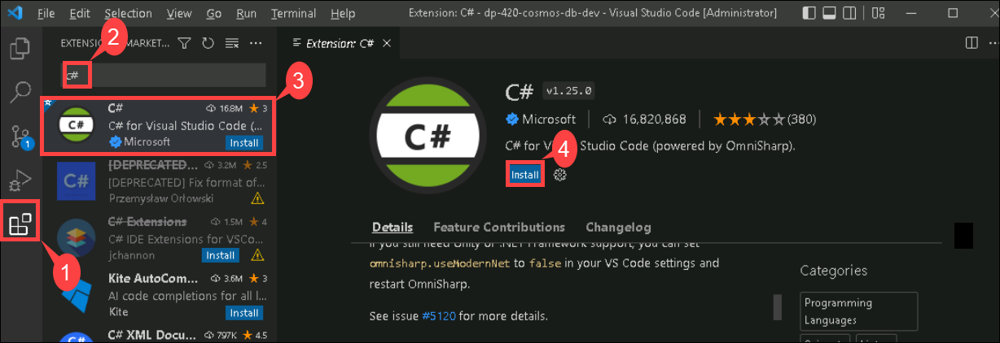

# Module 4 - Implement Azure Cosmos DB SQL API point operations

## Lab 3 :  Move multiple documents in bulk with the Azure Cosmos DB SQL API SDK

The easiest way to learn how to perform a bulk operation is to attempt to push many documents to an Azure Cosmos DB SQL API account in the cloud. Using the bulk features of the SDK, this can be done with some minor help from the [System.Threading.Tasks][docs.microsoft.com/dotnet/api/system.threading.tasks] namespace.

In this lab, you'll use the [Bogus][nuget.org/packages/bogus/33.1.1] library from NuGet to generate fictional data and place that into an Azure Cosmos DB account.

## Prepare your development environment

1. Start Visual Studio Code (the program icon is pinned to the Desktop).

2. Select the **Extension (1)** icon from the left pane. Enter **C# (2)** in the search bar and select the **extension (3)** that shows up and finally **Install (4)** on the extension. 

    

3. Select the **file** option on the top left of the screen, from the pane options, select **Open Folder** and navigate to **C:\AllFiles**.

4. Select the folder **dp-420-cosmos-db-dev** and click on **Select Folder**.

### Task 1: Use an Azure Cosmos DB SQL API account and configure the SDK project

1. Go to the **Azure Cosmos DB** account resource, which you created in previous lab and navigate to the **Keys** pane.

1. This pane contains the connection details and credentials necessary to connect to the account from the SDK. Specifically:

    1. Record the value of the **URI** field. You will use this **endpoint** value later in this exercise.

    1. Record the value of the **PRIMARY KEY** field. You will use this **key** value later in this exercise.

1. Still **Azure Cosmos DB** account resource, navigate to the **Data Explorer** pane.

1. Select the **Scale & Settings** node. In the Scale & Settings tab, set **Throughput** to **Autoscale** Save your changes.

1. Update the required Max RU/s **4000** and then Save your changes**. 

1. Close your web browser window or tab.

1. In **Visual Studio Code**, in the **Explorer** pane, browse to the **08-sdk-bulk** folder.

1. Open the **script.cs** code file within the **08-sdk-bulk** folder.

    > Note: The **[Microsoft.Azure.Cosmos][nuget.org/packages/microsoft.azure.cosmos/3.22.1]** library has already been pre-imported from NuGet.

1. Locate the **string** variable named **endpoint**. Set its value to the **endpoint** of the Azure Cosmos DB accountyou created in previous lab.
  
    ```
    string endpoint = "<cosmos-endpoint>";
    ```

    > Note: For example, if your endpoint is: **https&shy;://dp420.documents.azure.com:443/**, then the C# statement would be: **string endpoint = "https&shy;://dp420.documents.azure.com:443/";**.

1. Locate the **string** variable named **key**. Set its value to the **key** of the Azure Cosmos DB account you created in previous lab.

    ```
    string key = "<cosmos-key>";
    ```

    > Note: For example, if your key is: **fDR2ci9QgkdkvERTQ==**, then the C# statement would be: **string key = "fDR2ci9QgkdkvERTQ==";**.

1. **Save** the **script.cs** code file.

1. Open the context menu for the **08-sdk-bulk** folder and then select **Open in Integrated Terminal** to open a new terminal instance.

    > Note: This command will open the terminal with the starting directory already set to the **08-sdk-bulk** folder.

1. Add the [Microsoft.Azure.Cosmos][nuget.org/packages/microsoft.azure.cosmos/3.22.1] package from NuGet using the following command:

    ```
    dotnet add package Microsoft.Azure.Cosmos --version 3.22.1
    ```

1. Build the project using the [dotnet build][docs.microsoft.com/dotnet/core/tools/dotnet-build] command:

    ```
    dotnet build
    ```

1. Close the integrated terminal.

### Task 2: Bulk inserting a twenty-five thousand documents

Let's "go for the gusto" and try to insert a lot of documents to see how this works. In our internal testing, this can take approximately 1-2 minutes if the lab virtual machine and Azure Cosmos DB SQL API account are relatively close to each other geographically speaking.

1. Return to the editor tab for the **script.cs** code file.

1. Create a new instance of the [CosmosClientOptions][docs.microsoft.com/dotnet/api/microsoft.azure.cosmos.cosmosclientoptions] named **options** class with the **AllowBulkExecution** property set to a value of **true**:

    ```
    CosmosClientOptions options = new () 
    { 
        AllowBulkExecution = true 
    };
    ```

1. Create a new instance of the **CosmosClient** class named **client** passing in the **endpoint**, **key**, and **options** variables as constructor parameters:

    ```
    CosmosClient client = new (endpoint, key, options); 
    ```

1. Use the [GetContainer][docs.microsoft.com/dotnet/api/microsoft.azure.cosmos.cosmosclient.getcontainer] method of the **client** variable to retrieve the existing container using the name of the database (*cosmicworks*) and the name of the container (*products*):

    ```
    Container container = client.GetContainer("cosmicworks", "products");
    ```

1. Use this special sample code to generate **25,000** fictitious products using the **Faker** class from the Bogus library imported from NuGet.

    ```
    List<Product> productsToInsert = new Faker<Product>()
        .StrictMode(true)
        .RuleFor(o => o.id, f => Guid.NewGuid().ToString())
        .RuleFor(o => o.name, f => f.Commerce.ProductName())
        .RuleFor(o => o.price, f => Convert.ToDouble(f.Commerce.Price(max: 1000, min: 10, decimals: 2)))
        .RuleFor(o => o.categoryId, f => f.Commerce.Department(1))
        .Generate(25000);
    ```

    > Note: The [Bogus][nuget.org/packages/bogus/33.1.1] library is an open-source library used to design fictitious data to test user interface applications and is great for learning how to develop bulk import/export applications.

1. Create a new generic **List<>** of type **Task** named **concurrentTasks**:

    ```
    List<Task> concurrentTasks = new List<Task>();
    ```

1. Create a foreach loop that will iterate over the list of products that was generated earlier in this application:

    ```
    foreach(Product product in productsToInsert)
    {
    }
    ```

1. Within the foreach loop, create a **Task** to asynchornously insert a product into Azure Cosmos DB SQL API being sure to explicitly specify the partition key and to add the task to list of tasks named **concurrentTasks**:

    ```
    concurrentTasks.Add(
        container.CreateItemAsync(product, new PartitionKey(product.categoryId))
    );   
    ```

1. After the foreach loop, asynchronously await the result of **Task.WhenAll** on the **concurrentTasks** variable:

    ```
    await Task.WhenAll(concurrentTasks);
    ```

1. Use the built-in **Console.WriteLine** static method to print a static message of **Bulk tasks complete** to the console:

    ```
    Console.WriteLine("Bulk tasks complete");
    ```

1. Once you are done, your code file should now include:
  
    ```
    using System;
    using System.Collections.Generic;
    using System.Threading.Tasks;
    using Bogus;
    using Microsoft.Azure.Cosmos;
    
    string endpoint = "<cosmos-endpoint>";
    string key = "<cosmos-key>";
    
    CosmosClientOptions options = new () 
    { 
        AllowBulkExecution = true 
    };
    
    CosmosClient client = new (endpoint, key, options);  
    
    Container container = client.GetContainer("cosmicworks", "products");
    
    List<Product> productsToInsert = new Faker<Product>()
        .StrictMode(true)
        .RuleFor(o => o.id, f => Guid.NewGuid().ToString())
        .RuleFor(o => o.name, f => f.Commerce.ProductName())
        .RuleFor(o => o.price, f => Convert.ToDouble(f.Commerce.Price(max: 1000, min: 10, decimals: 2)))
        .RuleFor(o => o.categoryId, f => f.Commerce.Department(1))
        .Generate(25000);
        
    List<Task> concurrentTasks = new List<Task>();
    
    foreach(Product product in productsToInsert)
    {    
        concurrentTasks.Add(
            container.CreateItemAsync(product, new PartitionKey(product.categoryId))
        );
    }
    
    await Task.WhenAll(concurrentTasks);   

    Console.WriteLine("Bulk tasks complete");
    ```

1. **Save** the **script.cs** code file.

1. In **Visual Studio Code**, open the context menu for the **08-sdk-bulk** folder and then select **Open in Integrated Terminal** to open a new terminal instance.

1. Build and run the project using the **[dotnet run][docs.microsoft.com/dotnet/core/tools/dotnet-run]** command:

    ```
    dotnet run
    ```

1. The application should run silently, it should take approximately one to two minutes to run before completing silently.

1. Close the integrated terminal.

1. Close **Visual Studio Code**.

### Task 3: Observe the results

Now that you have sent 25,000 items to Azure Cosmos DB let’s go and look at the Data Explorer.

1. In a web browser, navigate to the Azure portal (``portal.azure.com``).

1. Select **Resource groups**, then select the resource group you created or viewed earlier in this lab, and then select the **Azure Cosmos DB account** resource you created in this lab.

1. Within the **Azure Cosmos DB** account resource, navigate to the **Data Explorer** pane.

1. In the **Data Explorer**, expand the **cosmicworks** database node, then observe the **products** container node within the **SQL API** navigation tree.

1. Expand the **products** node, and then select the **Items** node. Observe the list of items within your container.

1. Select the **products** container node within the **SQL API** navigation tree, and click on **...** then select **New SQL Query**.

1. Delete the contents of the editor area.

1. Create a new SQL query that will return a count of all documents created using the bulk operation:

    ```
    SELECT COUNT(1) FROM items
    ```

1. Select **Execute Query**.

1. Observe the count of the items in your container.

1. Close your web browser window or tab.

[code.visualstudio.com/docs/getstarted]: https://code.visualstudio.com/docs/getstarted/tips-and-tricks
[docs.microsoft.com/dotnet/api/microsoft.azure.cosmos.cosmosclient.getcontainer]: https://docs.microsoft.com/dotnet/api/microsoft.azure.cosmos.cosmosclient.getcontainer
[docs.microsoft.com/dotnet/api/microsoft.azure.cosmos.cosmosclientoptions]: https://docs.microsoft.com/dotnet/api/microsoft.azure.cosmos.cosmosclientoptions
[docs.microsoft.com/dotnet/api/system.threading.tasks]: https://docs.microsoft.com/dotnet/api/system.threading.tasks
[docs.microsoft.com/dotnet/core/tools/dotnet-build]: https://docs.microsoft.com/dotnet/core/tools/dotnet-build
[docs.microsoft.com/dotnet/core/tools/dotnet-run]: https://docs.microsoft.com/dotnet/core/tools/dotnet-run
[nuget.org/packages/bogus/33.1.1]: https://www.nuget.org/packages/bogus/33.1.1
